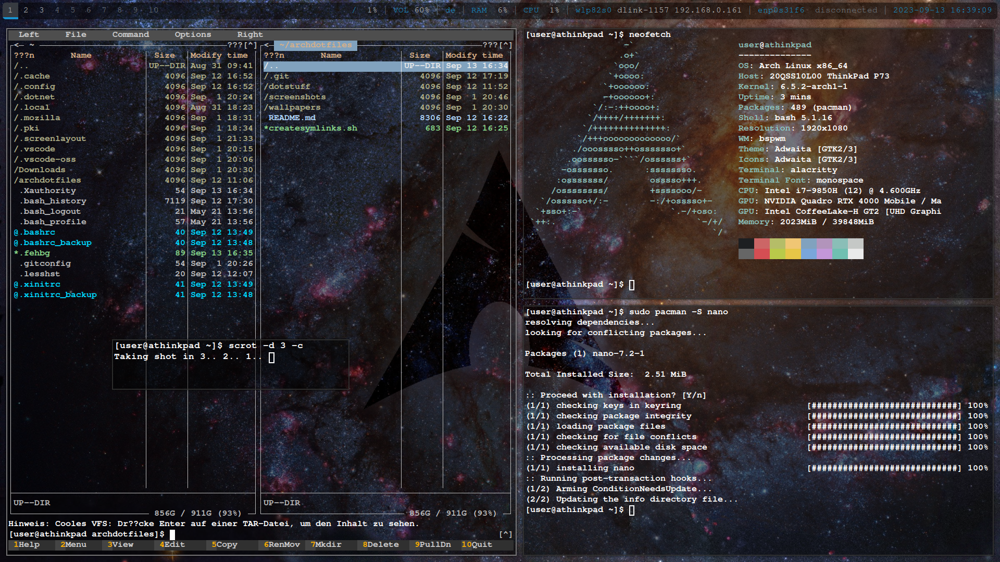

# on Arch-iso:

## Keyboardlayout

    loadkeys de-latin1

## Wlan

    iwctl
    device list
    station wlan0 scan
    station wlan0 get-networks
    station wlan0 connect SSID
        -> password
    station wlan0 show
    exit

## Time & Date

    timedatectl set-ntp true
    timedatectl set-timezone Europe/Berlin
    date

## Disk and Partitions

    fdisk -l
    cfdisk /dev/sda
        -> gpt
    New -> 4G -> Type: Linux swap
        (/dev/sda1)
    New -> 1G -> Type: EFI System
        (/dev/sda2)
    New -> Rest -> Type: Linux filesystem
        (/dev/sda3)
    Write -> yes -> Quit
    lsblk
    fdisk -l

    mkfs.ext4 /dev/sda3
    mkfs.fat -F32 /dev/sda2
    mkswap /dev/sda1

## Mount Partitions

    mount /dev/sda3 /mnt
    mkdir /mnt/efi
    mount /dev/sda2 /mnt/efi
    swapon /dev/sda1

## Install Arch

    pacstrap -i /mnt base base-devel linux linux-firmware nano git
        -> 1 (mkinitcpio)
    genfstab -U /mnt >> /mnt/etc/fstab

## Configure Arch using chroot

    arch-chroot /mnt
    ln -sf /usr/share/zoneinfo/Europe/Berlin /etc/localtime
    hwclock --systohc
    locale-gen
    echo "LANG=de_DE.UTF-8" >> /etc/locale.conf
    echo "KEYMAP=de-latin1" > /etc/vconsole.conf
    echo "athinkpad" >> /etc/hostname
    nano /etc/hosts
->
    
    # Static table lookup for hostnames.
    # See hosts(5) for details.
    127.0.0.1       localhost
    ::1             localhost
    127.0.0.1       athinkpad.localdomain athinkpad
CTRL+X -> Y -> Enter

    pacman -S networkmanager
    systemctl enable NetworkManager
    
    passwd
        -> root
`(change/remove after you added user!!!)`

    pacman -S grub efibootmgr
    lsblk
    grub-install --target=x86_64-efi --bootloader=GRUB --efi-directory=/efi --removable
    grub-mkconfig -o /boot/grub/grub.cfg
    exit
    umount -R /mnt
    reboot

wait for iso shutdown to complete, then: Remove USB

Select Arch in Bootmenu

# Boot Arch and login in tty1
    
    user: root
    password: root

## connect to wifi via NetworkManager

#### CLI method: password will be visible in history
    
    nmcli device wifi list
    nmcli devici wifi connect SSID password PASSWORD
#### TUI method: password won't be visible
    
    nmtui
    -> activate wifi
    -> connect to wifi
    -> quit

## add user (in this case username is user)

    useradd -m -g users -G wheel -s /bin/bash user
    passwd user
        -> your password
    pacman -S sudo
    EDITOR=nano visudo
        -> uncomment %wheel ALL=(ALL) ALL
    
    su user
    sudo pacman -S neofetch

if it worked, you're done, lock root account from login via

    sudo passwd -l root
(you can still sudo su root from your user account)

## Add Windows to Grub
    sudo fdisk -l
        -> Search for EFI System partition of Windows
    sudo mkdir /mnt/windowsefi
    sudo mount /dev/nvme0n1p2 /mnt/windowsefi
    sudo pacman -S os-prober
    sudo os-prober
        -> should say stf about Windows Boot Manager
    sudo nano /etc/default/grub
        -> Ctrl + W (search)-> Prober
        -> GRUB_DISABLE_OS_PROBER=false
    sudo grub-mkconfig -o /boot/grub/grub.cfg
    reboot
        -> try booting to windows

## DONE and useful stuff like Midnight Commander, less, etc

    sudo pacman -S neofetch mc less htop net-tools remmina tree
    neofetch
    mc -> Options -> Appearance -> Skin -> yadt256-defbg

# Desktop Environment 

## BSPWM

Install Driver

    sudo pacman -S xf86-video-intel
    sudo pacman -S xf86-video-amdgpu
    sudo pacman -S nvidia nvidia-utils nvidia-settings

Window manager stuff    
    
    sudo pacman -S xorg xorg-xinit bspwm sxhkd dmenu feh picom alacritty firefox arandr
    mkdir ~/.config/bspwm
    mkdir ~/.config/sxhkd
    cp /usr/share/doc/bspwm/examples/bspwmrc ~/.config/bspwm/
    cp /usr/share/doc/bspwm/examples/sxhkdrc ~/.config/sxhkd/
    nano ~/.config/sxhkd/sxhkdrc
        -> change `urxvt` under terminal to `alacritty`
    cp /etc/X11/xinit/xinitrc ~/.xinitrc
    nano ~/.xinitrc

-> delete everything and add

    setxkbmap de &
    picom -f &
    exec bspwm
save and exit, do:

    echo "setxkbmap de > /dev/null 2>&1" >> ~/.bashrc # Ensures keyboard is always correct

    startx
try:
    
- Super+Enter
- Super+W
- Super+Spacebar -> arandr -> Select monitor, select resolution, save as ~/.screenlayout/monitors.sh

cmds:

    chmod +x ~/.screenlayout/monitors.sh
    nano .xinitrc
-> add `` before `picom` and definitely before `exec bspwm`
    
    ~/.screenlayout/monitors.sh
    feh --bg-scale $HOME/archdotfiles/wallpapers/archgalaxy.jpg &
    xsetroot -cursor_name left_ptr

done

    startx
    firefox #get wallpaper via browser
    Select -> Ok -> Select Wallpaper -> Zoomed Fill -> Apply

    Super+Enter 
    mkdir -p ~/.config/alacritty
    nano ~/.config/alacritty/alacritty.yml
-> add:

    # Basic configuration
    window:
      dimensions:
        columns: 80
        lines: 24
      padding:
        x: 2
        y: 2
      opacity: 0.5
    
    font:
      normal:
        family: monospace
        style: Bold
      size: 10.0
    
    colors:
      primary:
        background: '#000000'
        foreground: '#ffffff'

-> reload terminal

For keybindings make familiar with 

    nano .config/sxhkd/sxhkdrc
    
To resize and move windows, add these lines to

    nano .config/bspwm/bspwmrc
add ->

    # move/resize windows
    bspc config pointer_modifier     mod1
    bspc config pointer_action1      move
    bspc config pointer_action2      resize_side
    bspc config pointer_action3      resize_corner

| Keybind              | Description   |
|----------------------|---------------|
| Super + S            | Floating      |
| Alt + Left Mouse     | Move Window   |
| Alt + Right Mouse    | Resize Window |
| Super + T            | Tiled         |
| Super + Shift + T    | Pseudo-tiled  |
| Super + F            | Fullscreen    |

## 2nd monitor

    xrandr
-> output name of 2nd monitor (e.g. HDMI-1-1)

    nano .config/bspwm/bspwmrc
change 
    
    bspc monitor -d 1 2 3 4 5 6 7 8 9 10
to
    
    bspc monitor -d 1 2 3 4 5
    bspc monitor HDMI-1-1 -d 6 7 8 9 10

## Polybar

    sudo pacman -S polybar
    mkdir ~/.config/polybar
    cp /usr/share/doc/polybar/examples/config.ini ~/.config/polybar/
    nano ~/.config/polybar/config.ini
    nano ~/.xinitrc
    -> add before picom: `polybar &`

## Activate Trackpad Tapping

    sudo nano /etc/X11/xorg.conf.d/40-libinput.conf
-> add

    Section "InputClass"
        Identifier "libinput touchpad catchall"
        MatchIsTouchpad "on"
        MatchDevicePath "/dev/input/event*"
        Driver "libinput"
        Option "Tapping" "on"
        Option "NaturalScrolling" "true"
    EndSection

## Audio and Brightness Keys

    sudo pacman -S pulseaudio pulseaudio-alsa alsa-utils brightnessctl
    pulseaudio --start
    nano ~/.config/sxhkd/sxhkdrc
add ->
    # Increase volume
    XF86AudioRaiseVolume
        amixer -q sset Master 5%+

    # Decrease volume
    XF86AudioLowerVolume
        amixer -q sset Master 5%-

    # Mute volume
    XF86AudioMute
        amixer -q sset Master toggle

    XF86AudioMicMute
        amixer sset 'Capture' toggle
    
    # Increase brightness
    XF86MonBrightnessUp
        brightnessctl s +10%

    # Decrease brightness, if brightness is 10% decrease to 1% rather than 0 directly
    XF86MonBrightnessDown
        if [ $(brightnessctl g) -eq 10 ]; then brightnessctl s 9%; else brightnessct> 

-> add to ~/.xinitrc before picom (brightness is default 50% every boot):

    brightnessctl s 100%

-> run this once, it should remember (microphone volume is default 0%)

    amixer sset 'Capture' 100%
    
# Grub Dual Boot Order and Themes
(forked from ChrisTitusTech)
mount windows boot manager partition in order for os-prober to find it

    sudo fdisk -l
    -> Search for EFI System partition of Windows
    sudo mkdir /mnt/windowsefi
    sudo mount /dev/nvme0n1p2 /mnt/windowsefi
clone theme installer

    cd ~
    git clone https://github.com/karlscholz/Top-5-Bootloader-Themes.git
    cd Top-5-Bootloader-Themes
    sudo ./install.sh
    1) Vimix
save current `grub.cfg`

    cd /boot/grub
    sudo cp grub.cfg grub.cfg.bak
open `grub.cfg` and remove unwanted entries

    sudo nano grub.cfg
change entries and order of entries, e.g. for Windows...

    ### BEGIN /etc/grub.d/30_os-prober ###
    menuentry 'Windows Boot Manager (on /dev/nvme0n1p2)' --class windows --class os $menuentry_id_option 'osprober-efi-3065-1F45' {
    insmod part_gpt
    insmod fat
    search --no-floppy --fs-uuid --set=root 3065-1F45
    chainloader /EFI/Microsoft/Boot/bootmgfw.efi
    }
    ### END /etc/grub.d/30_os-prober ###
to e.g.:
    
    ### BEGIN /etc/grub.d/30_os-prober ###
    menuentry 'Windows 11' --class win...
    ...
    ### END /etc/grub.d/30_os-prober ###
and delete unwanted options like `Advanced options for Arch Linux` and `UEFI Firmware Settings`

if you want you can also change the timeout from 60 seconds to sth else, find the line `set timeout=60` and edit.

save, exit and reboot, `if you bricked grub` (which you'll definitely do at least once), don't panic and boot from arch iso boot stick.

find main linux partition

    fdisk -l
mount it

    mount /dev/sda3 /mnt
    arch-chroot /mnt
    
use chroot and restore `grub.cfg.bak` or rebuild grub.cfg via `grub-mkconfig -o /boot/grub/grub.cfg`

# Miscellaneous
## Official Visual Studio Code (Copilot)

download from https://code.visualstudio.com/# -> `other platforms` the .tar.gz file

    tar -xzf ~/Downloads/code-stable-x64-1691619534.tar.gz
    sudo mv VSCode-linux-x64/ /usr/local/
    sudo ln -s /usr/local/VSCode-linux-x64/code /usr/local/bin/code
-> restart terminal

## Screenshots:

    sudo pacman -S scrot
    scrot <(-d 5) # 5 seconds delay> <(-c) # countdown> <(-s) # select area> <filename.png (optional)>
    scrot -d 5

## Firefox:

    Theme: Dark
    about:config -> ui.key.menuAccessKeyFocuses -> false (alt key is used by bspwm, nobody needs the file-edit-etc menu anyway)

# TODO: 
- rice dmenu
- battery percentage in polybar